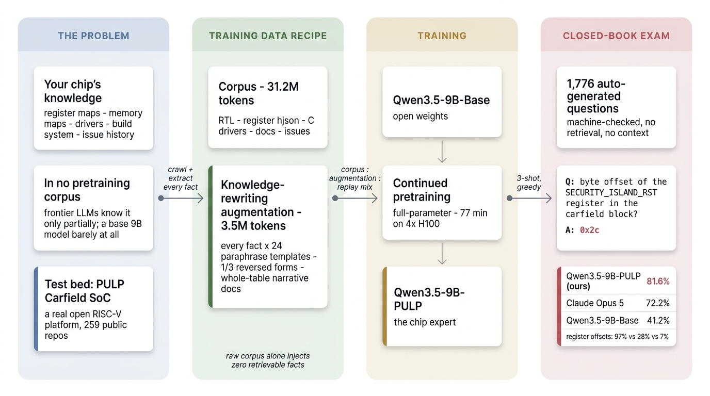

# PULP-LLM — Teach an Open Model Everything About Your Chip

[](https://huggingface.co/AgentNativeResearchLab/Qwen3.5-9B-PULP-DAPT)
[](https://huggingface.co/Qwen/Qwen3.5-9B-Base)
[](eval/)
[](training/)
[](LICENSE)

**A 9B open model that knows a real SoC platform better than Claude Opus 5.** After 77
GPU-minutes of continued pretraining, it answers closed-book factual questions about the
[PULP](https://pulp-platform.org/) Carfield/Cheshire chip platform at **81.6% vs Opus 5's
72.2%** (base model: 41.2%) on a 1,776-question benchmark — and on pure register-map recall
it reaches **97% where Opus manages 28%**.

The score is not the point — the *recipe* is. Continued pretraining on the raw corpus alone
injects **zero** retrievable knowledge (the loss drops; recall doesn't move). Every point of
improvement comes from a **knowledge-rewriting augmentation** stage, and this repo is the
full, reproducible recipe for it: corpus → augmentation → training → benchmark, end to end.



- Model weights: **[AgentNativeResearchLab/Qwen3.5-9B-PULP-DAPT](https://huggingface.co/AgentNativeResearchLab/Qwen3.5-9B-PULP-DAPT)**
- Base model: [Qwen/Qwen3.5-9B-Base](https://huggingface.co/Qwen/Qwen3.5-9B-Base)
- Evaluated platform: [pulp-platform/carfield](https://github.com/pulp-platform/carfield), pinned as a submodule under `third_party/`

---

## 1. The problem

**The pain point.** Chip companies want an LLM that *knows their chip* — its register map,
memory map, build system, drivers, and issue history. None of that is in any pretraining
corpus, and much of it (a register offset, a dependency pin) is exactly the kind of arbitrary
fact LLMs are worst at absorbing. This is the [ChipNeMo](https://arxiv.org/abs/2311.00176)
setting: an internal engineering assistant whose knowledge lives *in the weights*, with no
retrieval pipeline to build, chunk, or keep in sync.

**Why this test bed.** As a public, license-clean stand-in for a proprietary chip we use the
PULP Carfield/Cheshire platform (ETH Zürich): a real, actively developed heterogeneous
RISC-V SoC whose facts are public *but obscure enough* that a frontier model knows them only
partially, while a base 9B model knows almost nothing (near guess level on register facts).
That gap is the experiment: it lets one measurement separate "the model reasons well" from
"the model actually knows this chip".

**The ability under test.** Closed-book factual recall — no retrieval, no context, 3-shot
answer-format priming only. Can a small open model, cheaply adapted, *know* a specific
hardware platform better than the frontier model a chip team would otherwise use?

## 2. Contributions

1. **A knowledge-rewriting augmentation recipe that actually injects facts.** Raw-corpus
   continued pretraining teaches the corpus *distribution*, not extractable facts; restating
   every fact in many diverse surface forms is what makes it retrievable. The recipe's design
   rules (§3) are the core of this repo.
2. **Open weights that beat a frontier model on the target domain.** A 9B model at 81.6% vs
   Claude Opus 5 at 72.2% closed-book, trained in 77 minutes on 4×H100.
3. **A 1,776-question auto-generated benchmark** for chip-platform knowledge — layered by
   the kind of knowledge an engineer needs, fully machine-checkable, with an
   anti-lexical-leak filter on every multiple-choice question — plus the pipeline to rebuild
   it for any other platform.

## 3. Training data recipe

The data pipeline has two products: a *corpus* (what the domain looks like) and an
*augmentation set* (what the model must memorize). The recipe's central lesson: **the corpus
carries the distribution, the augmentation carries the facts** — skip the augmentation and
recall does not move.

### 3.1 Corpus — 31.2M tokens (`data/crawl_pulp.py`)

1. Clone all 259 non-fork repos of the `pulp-platform` GitHub org + issues/PRs of the top 60.
2. Filter aggressively: drop toolchain forks (binutils/glibc/newlib — 168M chars of noise),
   NN example repos, `tests/golden/vectors` payloads; dedupe by content hash.
3. Keep RTL (`.sv/.v`), register definitions (`.hjson`), docs (`.md/.rst`), C
   drivers/headers, build manifests (`Bender.yml`), issue threads → JSONL, one
   `{"text": ...}` doc per file.

### 3.2 Knowledge-rewriting augmentation — 3.49M tokens ≈ 10% of corpus (`data/gen_templates.py` + `data/gen_aug_v3.py`)

Design rules, in the order they matter:

1. **Enumerate *every* fact, not just the ones you plan to quiz.** Augmentation coverage
   determines the extractable scope — the model gains only on facts the augmentation
   covered, so treat the benchmark as a sampled audit of full coverage. Facts come from
   structured sources: all ~340 register offsets from generated C headers, all hjson fields
   (bits/swaccess/desc), both memory maps, Bender dependency pins, RTL instantiations,
   driver-function↔register-macro pairs (static analysis), issue metadata.
2. **Diversity beats repetition.** 24 LLM-written paraphrase templates per fact type ×6
   repeats far outperforms a handful of hand templates repeated more often: datasheet prose,
   table rows, C comments, forum answers, quiz Q/A, changelogs. One LLM call per fact type
   writes the templates; placeholders are validated programmatically.
3. **≥1/3 reversed forms** ("At offset 0x14 sits CTRL") — otherwise the reversal curse makes
   facts one-directional.
4. **Whole-table narrative documents** — the full register map as prose/table/header in
   several traversal orders — so hundreds of near-identical facts serve as each other's
   context instead of interfering. Similar-fact interference, not exposure count, is the
   memorization bottleneck.
5. Pack 12 statements per document; never emit exact benchmark phrasings.
6. **Mix** `corpus : augmentation : wikitext replay ≈ 31.2M : 3.49M : 2.5M` (replay ≈ 8%,
   ChipNeMo-style, against catastrophic forgetting).

## 4. Training recipe

`training/modal_dapt.py` (runs on [Modal](https://modal.com); adaptable to any 4-GPU node)

| Item | Value |
|---|---|
| Base model | Qwen/Qwen3.5-9B-Base (base, **not** instruct — ChipNeMo rule) |
| Method | Continued pretraining (`stage=pt`), **full-parameter**, bf16 |
| Framework | LLaMA-Factory 0.9.5 + DeepSpeed ZeRO-3 + transformers 5.6 |
| LR | 5e-6, cosine, warmup 1% (ChipNeMo-scale small LR) |
| Batch | global 16 = 4 GPUs × micro-batch 2 × grad-accum 2, packing at cutoff 4096 |
| Epochs | 2 |
| Hardware | 4×H100-80GB, **77 minutes** |

Performance notes that mattered (2.2× total speedup, measured):
- `flash-linear-attention` is **required** for Qwen3.5's gated-delta-net layers (25 → 7.4 s/it).
- ZeRO-3 + micro-batch 2 (or equivalently ZeRO-2): 7.43 → **3.41 s/it**.
- `PYTORCH_CUDA_ALLOC_CONF=expandable_segments:True` to tame allocator fragmentation.
- Eval: vLLM with `enable_prefix_caching=True` (all questions share the few-shot prefix).

## 5. Evaluation

`eval/` — all questions are auto-generated from authoritative sources and machine-checkable
(exact match after normalization, or 4-way MC with auto-generated distractors; zero human or
LLM judging). The benchmark is **layered by the kind of knowledge an engineer actually
needs**:

| Layer | Content | Source |
|---|---|---|
| L1 facts | register offsets, base addresses, field bits, sw access | generated C headers, hjson, `reg_pkg.sv` |
| L2 structure | memory-map region ownership & sizes, dependency pins | memory maps, `Bender.yml` |
| L3 behavior | documentation description ↔ register/field (MC) | hjson `desc` |
| L4 cross-source | which driver function touches which register | static analysis of `sw/**/*.c` |
| L5 engineering | issue title → repository (MC) | GitHub issues |

Question-design rules that proved necessary: every MC question passes an anti-lexical-leak
filter (a question is kept only if every distractor's lexical overlap with the question is ≥
the answer's — otherwise strong models solve it by word matching without any knowledge), and
the few-shot exemplars cover every answer format (a shot set without a hex example silently
depresses offset scores).

Files: `questions_pulp_v3.jsonl` (full bank, 1,776), `eval_pulp_v3.jsonl` (stratified
125-question audit subset for cheap comparisons), `fewshot_pulp_v3.jsonl` (3 shots covering
each answer format), `score_v3.py` (scorer). Protocol: 3-shot completion, greedy,
`max_tokens=24`.

## 6. Results

**Full bank — all 1,776 auto-generated questions, closed-book.** Only 125 of these were ever
inspected during development; the other 1,651 are effectively held out, so the numbers below
are not tuned-on-test:

| Model | Total | L1 facts (419) | L2 struct (53) | L3 behav (53) | L4 cross (25) | L5 eng (1,226) |
|---|---|---|---|---|---|---|
| Qwen3.5-9B-Base | 41.2% | 30/419 (7%) | 17/53 | 47/53 | 13/25 | 625/1226 (51%) |
| Claude Opus 5 | 72.2% | 116/419 (28%) | 42/53 | 52/53 | 13/25 | 1060/1226 (86%) |
| **Qwen3.5-9B-PULP-DAPT (this repo)** | **81.6%** | **406/419 (97%)** | 36/53 | **53/53** | **25/25** | 930/1226 (76%) |

The layer profiles are complementary: Opus wins where semantic association helps (issue→repo,
region ownership) but collapses on pure memorization (register offsets: 28%); the adapted
model is the mirror image — which is exactly the knowledge a RAG-free internal assistant
needs to have in weights.

Known limits (stated, not hidden): L3 multiple-choice is largely solvable by semantic
name-matching for strong models (all models >90%) — it does not differentiate; the adapted
model's remaining weakness is numeric range-membership reasoning (L2 region ownership) —
range queries need reasoning over the memory map, not fact recall; no
catastrophic-forgetting audit (e.g. MMLU) has been run yet. Per-model result files:
`eval/results/*_fullbank1776.json` (and `*_subset125.json`).

## 7. Reproduce

```bash
git clone --recursive https://github.com/ARA-Labs/PULP-LLM
cd PULP-LLM
ln -s third_party/carfield carfield   # question/augmentation generators read carfield/ at the repo root

# 1) corpus (needs gh CLI for issues)
python data/crawl_pulp.py clone && python data/crawl_pulp.py issues --top 60 && python data/crawl_pulp.py corpus

# 2) question bank + augmentation
python data/gen_pulp_v3.py --eval-n 130
python data/gen_templates.py                      # one claude -p call per fact type
python data/gen_aug_v3.py                         # -> dapt_corpus/aug3.jsonl

# 3) train on Modal (4xH100, ~77 min)
modal volume put pulp-dapt dapt_corpus/pulp_hw.jsonl /data/pulp_corpus.jsonl
modal volume put pulp-dapt dapt_corpus/aug3.jsonl  /data/aug3.jsonl
modal run training/modal_dapt.py::prepare
TRAIN_GPU=H100:4 modal run --detach training/modal_dapt.py::train --run-name dapt3 --epochs 2 --datasets pulp,replay,aug3 --zero 3 --pdbs 2

# 4) evaluate
modal run training/modal_dapt.py::evaluate --model /vol/models/dapt3 --tag dapt3 \
  --questions-b64 "$(base64 -w0 eval/eval_pulp_v3.jsonl)" --fewshot-b64 "$(base64 -w0 eval/fewshot_pulp_v3.jsonl)"
```

## 8. Repo layout

```
data/       corpus crawler, fact extraction, LLM template generation, augmentation builder
training/   Modal app: continued-pretraining run + vLLM closed-book evaluation
eval/       question bank (full + audit subset), scorer, per-model results
third_party/carfield   git submodule -> pulp-platform/carfield, pinned at the exact commit
            all benchmark questions and augmentation facts were extracted from
```

Note on scope: the *training corpus* is the whole `pulp-platform` org (259 repos), crawled
at run time by `data/crawl_pulp.py` — far too large to vendor. The submodule pins only
`carfield`, the single source tree that the benchmark and the augmentation facts are
generated from, so the ground truth is reproducible at an exact commit.

## Acknowledgements & license

Built on the open hardware of the [PULP platform](https://pulp-platform.org/) (ETH Zürich &
University of Bologna; SolderPad/Apache licenses) — referenced as a submodule, not copied.
Base model by Qwen. Recipe inspiration: NVIDIA ChipNeMo; extraction theory: Allen-Zhu & Li,
*Physics of Language Models 3.1*.

Code and question bank: Apache-2.0. Model weights inherit the Qwen3.5 license.
